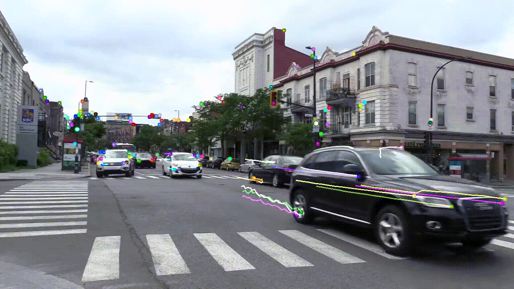

# Opencv_Projects

## optical flow use
To save the video keep the --save_video flag to True

```
python optical_flow.py data/street.mp4 --save_video true
```
### Results of optical flow


## Motion detection use

change the algoryth according to your need using --algo flag (KNN, MOG2)
```
python motion_detection.py --input data/street.mp4  --algo KNN --save_video true
```
### Results of Motion detection

